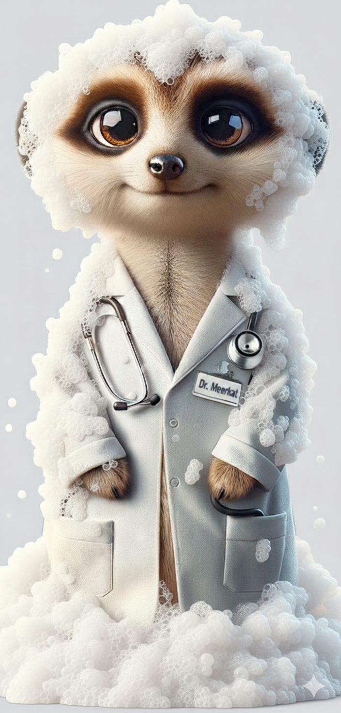
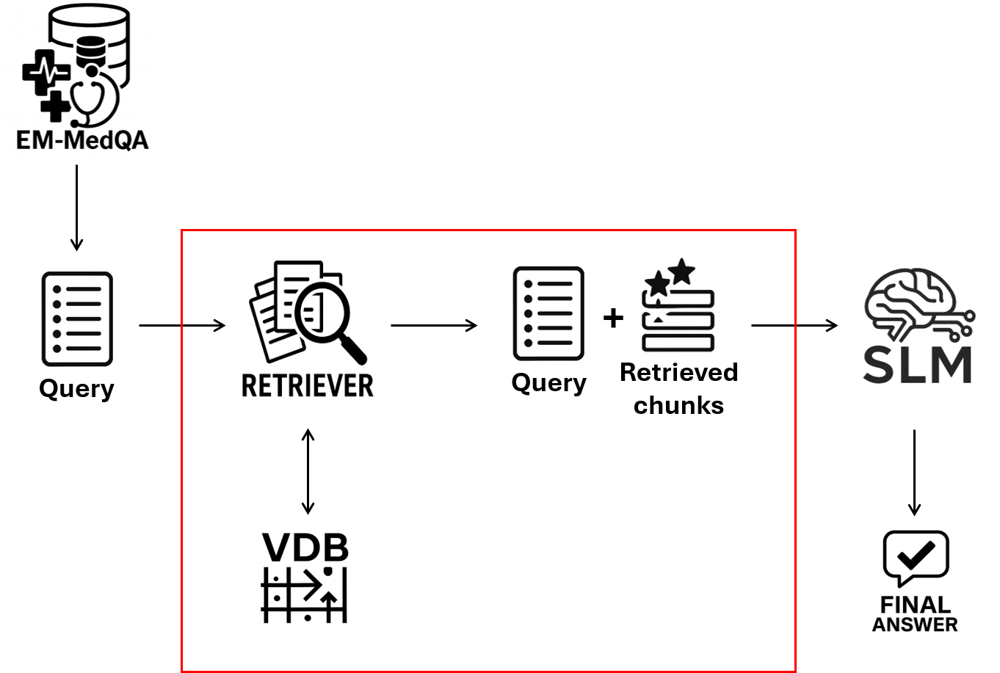
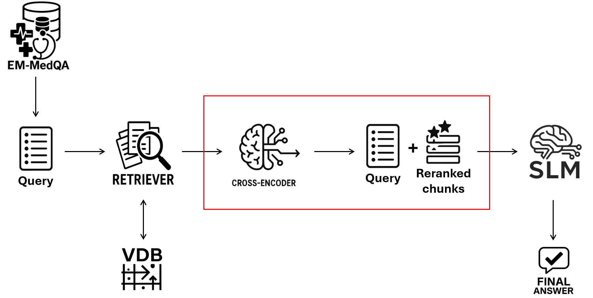
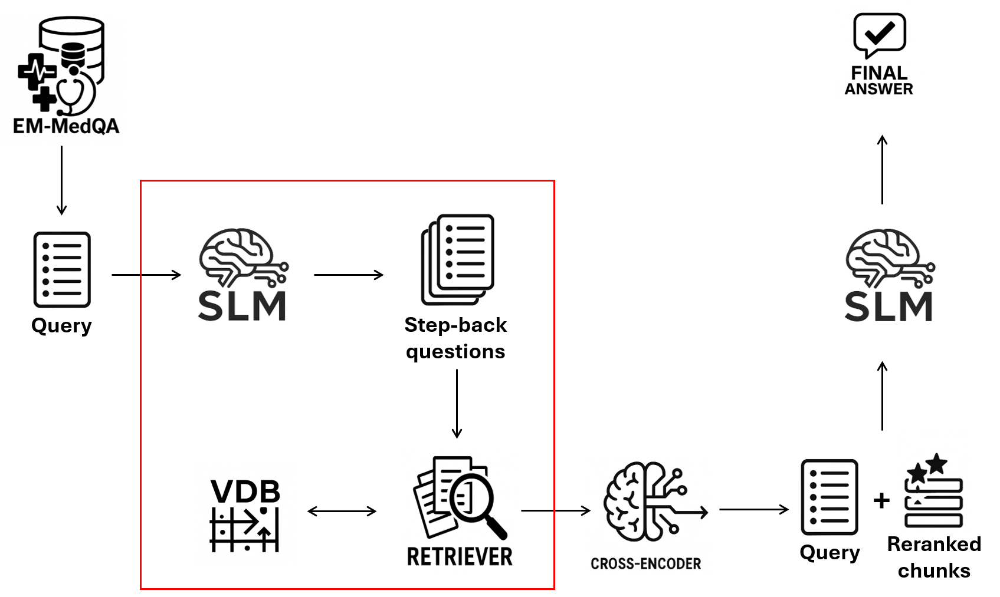
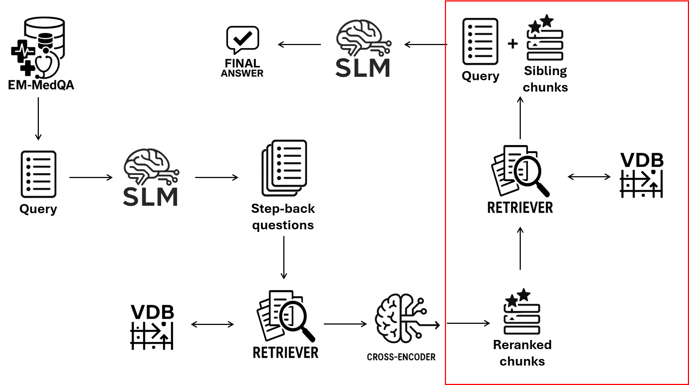

## Overview

  

Welcome to **FOAMed-Meerkat-7B** — let’s get foamy!

> **Disclaimer:** All code, models, and outputs in this repository are intended **only** for research and educational purposes. They are **not validated for clinical, diagnostic, or real-world operational use** and should not be relied upon in any setting involving patient care or safety-critical decisions.

  

**Project aim.** FOAMed-Meerkat-7B evaluated whether a small language model (Meerkat-7B) can answer emergency-medicine MCQs more reliably using Retrieval-Augmented Generation (RAG). I built and compared several pipelines—naïve retrieval, cross-encoder reranking, step-back question generation, and sibling-chunk enrichment—on the EM-MedQA dataset derived from FOAMed sources. The repo includes reproducible code for vector-store creation and batched evaluation; raw data cleaning and EM-MedQA preparation (which involved GPT-4o assistance and some manual steps) are documented separately in `raw_data/` and `dataset/`.

---

## RAG variants at a glance

<table>
<tr>
  <td align="center">
     
    <b>Naïve RAG.</b> Retrieve top-<i>k</i> chunks from the vector DB, filter by relevance, assemble context, and answer with the SLM.
  </td>
  <td align="center">
     
    <b>Rerank RAG.</b> Retrieve candidates, score each (question, chunk) pair with a cross-encoder, keep top-N, then answer.
  </td>
</tr>
<tr>
  <td align="center">
     
    <b>Step-Back RAG.</b> First call: generate 1–3 higher-level step-back questions; retrieve and rerank per SB query; merge context. Second call: answer.
  </td>
  <td align="center">
     
    <b>Sibling-Chunks.</b> Expand each hit with adjacent chunks from the same source before answering.
  </td>
</tr>
</table>

## Assets & attribution

- **Mascot image.** The “Dr. Meerkat” illustration (`assets/FOAMed-Meerkat-7B.png`) was generated with **Google Gemini**.
- **Schematic components.** Several icons/shapes used in the RAG pipeline figures were created with **ChatGPT-5** image tooling; the final layouts and captions were composed by me.
- If you plan to redistribute images, please review the respective model/tool licenses and usage terms.

